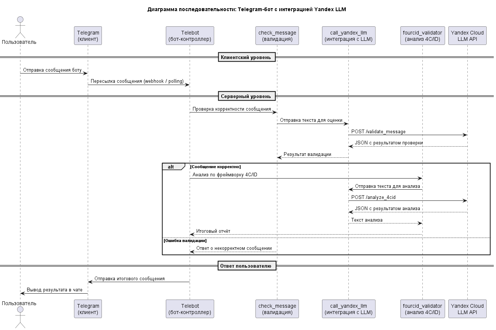

# Telegram Bot для аудита образовательных программ 🎓🤖

Привет! Этот бот помогает методистам и проектировщикам образовательных программ проводить аудит по фреймворку **4C/ID**.  

### Зачем это нужно?
Аудит помогает убедиться, что учебная программа реально учит нужным навыкам. Фреймворк 4C/ID мощный, но сложный: много компонентов, взаимосвязей и деталей. Бот делает этот процесс проще и быстрее. ⚡  

---

### Архитектура проекта 🏗️
Ниже схема работы бота:  


---

### Разворачивание окружения 🌱
1. Установите [Poetry](https://python-poetry.org/docs/#installation)
2. Создайте виртуальное окружение и установите зависимости:
```bash
poetry install
poetry shell
```

### Настройка `.env` 🛠️

Создайте файл `.env` в корне проекта и добавьте туда следующие переменные:

```env
YA_LLM_URL = " "          # URL модели
api_key = " "   # API-ключ Яндекс
TG_TOKEN = " "     # Токен вашего Telegram-бота
folder_id = " "      # ID папки сервисного аккаунта Яндекс
```

### Запуск бота ▶️

После настройки окружения и `.env` выполните команду:

```bash
poetry run python bot.py
```